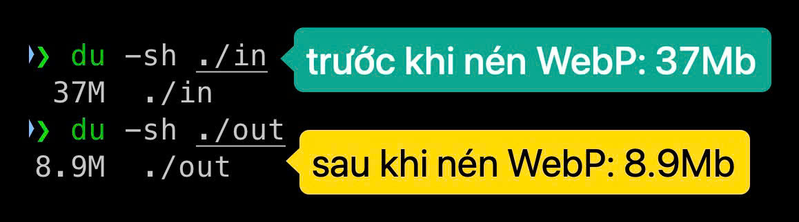

# Convert image to webp
Định dạng WebP có kích thước luôn nhỏ hơn các loại định dạng ảnh còn lại. Nhiệm vụ của docker image / mã nguồn này là convert tất cả các file ảnh trong folder `in` sang định dạng WebP rồi lưu vào folder `out`.



### Chức năng chính
- Convert tất cả các file ảnh (gif, jpeg, jpg, png) trong folder `in` sang định dạng WebP rồi lưu vào folder `out`
- Nếu file đã ở định dạng WebP hay PDF thì copy luôn, không resize, không convert
- Nếu file có kích thước rộng > 1024px hoặc cao > 768px thì resize về để nhỏ hơn 1024x768px, giữ nguyên tỷ lệ rồi mới convert
- Những file định dạng khác thì copy nguyên từ `in` sang `out`

### Sử dụng ngay mà không cần cài đặt
```
docker run --rm -it -v /absolute/localpath/in:/var/in -v /absolute/localpath/out:/var/out convertwebp:latest
```

### Cài đặt để lập trình
Chỉ cần cài đặt duy nhất thư viện`vips`. Trên MacOSX chạy:
```
brew install vips
```

### Chạy thử
Hãy đảm bảo có thư mục `out` trong convertwebp trước khi chạy
```
git clone https://github.com/techmaster-vietnam/convertwebp
cd convertwebp
go run .
```

### Build ra file binary và chạy
```
go build -o convertwebp .
./convertwebp -in ./in -out ./out -lossyQuality 80
```


### Đóng gói thành Docker image và chạy
```
docker build -t convertwebp .
docker run --rm -it -v /absolute/localpath/in:/var/in -v /absolute/localpath/out:/var/out convertwebp:latest
```

Ví dụ với đường dẫn cụ thể, tuyệt đối
```
docker run --rm -it -v /Users/cuong/CODE/techmasterweb/convertwebp/in:/var/in -v /Users/cuong/CODE/techmasterweb/convertwebp/out:/var/out convertwebp:latest
```

### Muốn dùng lại mã nguồn
Chỉ cần copy thư mục `convertwebp` vào project của bạn